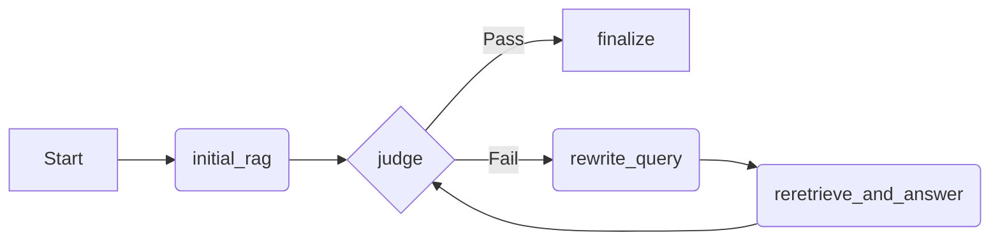

# CorrectiveRAG LangGraph Gemini

This project implements a full **Corrective RAG (Retrieval-Augmented Generation)** pipeline using **LangGraph**, **LangChain**, **Chroma**, and **Google Gemini**.

It was built as part of an academic assignment to demonstrate multi-step RAG reasoning, iterative correction, and structured evaluation.

---

## 🎯 1. Project Overview

The system answers a user question by following a self-correcting workflow:

1.  **Initial Answer:** Performs a standard RAG retrieval and generation.
2.  **Judgment:** An LLM "Judge" evaluates if the answer is complete, accurate, and grounded.
3.  **Correction:** If the answer fails, the system rewrites the query based on the failure reason.
4.  **Re-retrieval:** Fetches documents again using the optimized query (with stricter search parameters).
5.  **Finalization:** Generates a corrected final answer with precise citations.

The workflow is orchestrated using **LangGraph** with clearly defined nodes, state management, and conditional edges.

---

## 🎓 2. Learning Objectives

This project demonstrates the following core concepts:

* **State Management:** How LangGraph uses state, nodes, and conditional routing to control application flow.
* **Complex Workflows:** Building a multi-step Corrective RAG pipeline.
* **Integration:** Combining vector retrieval, LLM-based judgment, and iterative query rewriting.
* **Groundedness:** Generating answers that are strictly supported by citations.
* **Structured Output:** Handling strict JSON evaluation for LLM judges.
* **Evaluation:** Assessing RAG performance based on answer completeness and relevance.

---

## 📘 3. Knowledge Sources

The project retrieves information from a local vector store built from **6 official LangGraph/LangChain documentation pages**, including:

* LangGraph Overview
* Graph API
* Workflows & Agents
* LangChain Retrieval
* LangChain RAG Tutorial
* LangChain Agents

Each document chunk includes metadata for traceability:

```json
{
  "source_url": "[https://docs.langchain.com/](https://docs.langchain.com/)...",
  "section_title": "Graph API Overview"
}
````

These metadata fields are used to produce clear, clickable citations in the final output.

-----

## 🧩 4. Workflow Nodes

The Corrective RAG pipeline consists of five distinct nodes:

1.  **`initial_rag`**
      * Retrieves documents and produces a draft answer.
2.  **`judge`**
      * Evaluates the draft answer with a strict JSON-based scoring rubric:
          * Is it complete?
          * Is it grounded in the text?
          * Is it relevant?
          * Is it free of hallucinations?
3.  **`rewrite_query`**
      * Rewrites the user's question based on specific failure reasons identified by the judge.
4.  **`reretrieve_and_answer`**
      * Uses a stronger retriever configuration (e.g., `k=8`) to answer the question again.
5.  **`finalize`**
      * Generates the final response containing:
          * The answer
          * Citations
          * Decision log (Pass/Fail history)
          * Rewritten queries (if any)
          * Draft answer history

-----

## 🔀 5. Graph Routing

Conditional edges determine the flow of execution:



  * **Path 1 (Success):** `initial_rag` → `judge` (Pass) → `finalize`
  * **Path 2 (Correction):** `initial_rag` → `judge` (Fail) → `rewrite` → `reretrieve_and_answer` → `judge` ...

*Note: The system is configured to retry a maximum of 2 times (`MAX_ATTEMPTS=2`) before finalizing to prevent infinite loops.*

-----

## 📦 6. Vector Store Construction

The data pipeline handles the ingestion process:

  * **Loading:** Supports `.html`, `.htm`, `.txt`, `.md` files.
  * **Cleaning:** Converts HTML to clean text via `BeautifulSoup` (extracting only relevant body content).
  * **Splitting:** Uses `RecursiveCharacterTextSplitter` for optimal chunking.
  * **Embedding & Storage:** Saves the vector store locally using **ChromaDB** with **HuggingFace BCE Embeddings**.

-----

## 🧪 7. Running the Demo

Ensure you have installed the requirements:

```bash
pip install -r requirements.txt
```

Run the main script:

```bash
python corrective_rag.py
```

  * **Auto-Build:** If no vector store exists at `vectorstore/langgraph`, the script will build one automatically from the `docs/` folder.
  * **Interaction:** You will be prompted:
    `Enter your question:`
  * **Output:** The system runs through the full Corrective RAG workflow and prints a structured final answer with decision logs.

-----

## 🧵 8. Self-Verification Questions

This project serves as a practical demonstration of:

1.  The difference between a **Node** and an **Edge** in LangGraph.
2.  The importance of **State** in maintaining context across workflow steps.
3.  How **conditional routing** enables dynamic decision-making.
4.  The purpose of the **MemorySaver checkpointer** for graph persistence.
5.  The essential components of a standard **RAG chain**.

-----

## 📚 9. Tech Stack

  * **Language:** Python 3.10+
  * **Orchestration:** LangGraph / LangChain
  * **LLM:** Google Gemini (via `langchain-google-genai`)
  * **Vector Database:** ChromaDB
  * **Embeddings:** HuggingFace BCE Embeddings (`maidalun1020/bce-embedding-base_v1`)
  * **Parsing:** BeautifulSoup4

-----

## 📌 10. Repository Structure

```text
CorrectiveRAG-LangGraph-Gemini/
├── corrective_rag.py      # Main Corrective RAG pipeline (LangGraph workflow)
├── requirements.txt       # Python dependencies
├── .env                   # Environment variables (API Keys)
├── .gitignore             # Git ignore rules
├── docs/
│   └── langgraph/         # Local documentation files used to build the vector store
├── vectorstore/
│   └── langgraph/         # Auto-generated Chroma vector store
└── README.md              # Project documentation
```

-----

## 🙌 11. Acknowledgments

This project is part of academic coursework for LangGraph and RAG systems, demonstrating structured AI evaluation and iterative correction.

```
```
